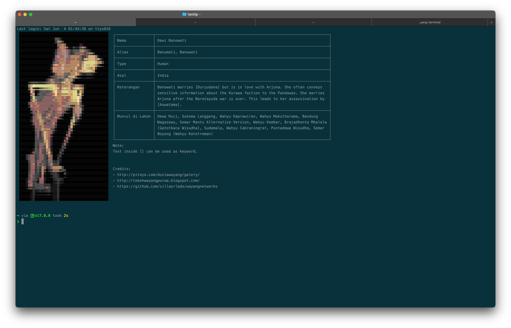

# Wayang-Terminal

Learn about javanese puppet (wayang/ꦮꦪꦁ) character each time you open up terminal.

Wayang-Terminal is a CLI tool that displays a new character of javanese puppet (wayang) on your terminal every time you run it.


## Installation

Clone this repository

```bash
git clone https://github.com/lantip/wayang-terminal.git
```

## Usage
Go to `wayang-terminal` directory, and execute `wayang`.

```bash
$ cd wayang-terminal
$ wayang
```

#### add to .bashrc 

Copy the `wayang` file to `/usr/local/bin` directory, and add `wayang` to your `.bashrc` or `.zshrc`

## Credit
The wayang image used in this application is mainly from:
[blog Pitoyo Amrih](http://pitoyo.com/duniawayang/galery/) and [blog Tokoh Wayang Purwa](http://tokohwayangpurwa.blogspot.com/), while the description about each character, comes from this [Villaorlado repository](https://github.com/villaorlado/wayangnetworks).


## License
[ABRMS License](./ABRMS-License.md)